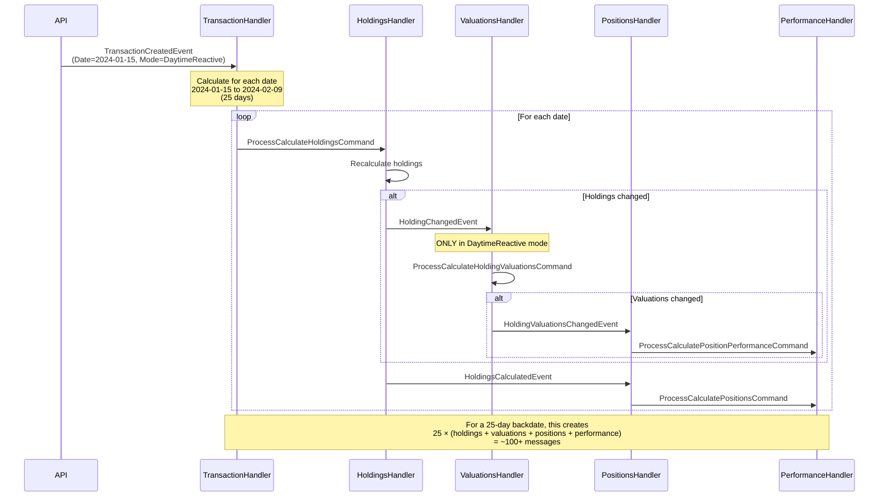

# Transaction Created Event Flow (DaytimeReactive Mode)

Last Updated: 2026-02-09

## Overview

When a transaction is created or updated with a backdated date, it triggers a cascade of recalculations from that date forward to today. This is the primary cause of deadlocks in daytime processing.

## Event Flow Diagram



## Message Cascade Breakdown

### Single Day Calculation
For one day's recalculation:
1. `ProcessCalculateHoldingsCommand` → Holdings recalc
2. `HoldingChangedEvent` (DaytimeReactive only) → Triggers valuation cascade
3. `HoldingsCalculatedEvent` → Triggers position recalc
4. `HoldingValuationsChangedEvent` → Triggers performance cascade
5. `PositionsCalculatedEvent` → Snapshot update
6. `PositionPerformanceCalculatedEvent` → Final state

**Total per day: ~6 messages**

### 30-Day Backdate
- 30 days × 6 messages = **~180 messages**
- Processing time: 30-60 seconds (depending on portfolio size)
- SQL queries: 300+ (10+ per day)
- Deadlock risk: **HIGH**

### 90-Day Backdate
- 90 days × 6 messages = **~540 messages**
- Processing time: 2-5 minutes
- SQL queries: 900+
- Deadlock risk: **CRITICAL**

## Deadlock Risk Areas

### 1. Concurrent Date-Range Processing
**Scenario:** Two transactions for different dates cause overlapping date ranges to be processed simultaneously.

```
Transaction A (dated 2024-01-15):
  Processes: 2024-01-15 → 2024-02-09

Transaction B (dated 2024-01-20):
  Processes: 2024-01-20 → 2024-02-09

Overlap: 2024-01-20 → 2024-02-09 (20 days)
```

Both threads attempt to update the same portfolio/position rows for overlapping dates, causing:
- SQL `UPDATE` lock contention
- Rebus message redelivery
- Timeout exceptions

### 2. Circular Invalidation
**Scenario:** PortfolioValuationInvalidationHandler and PortfolioPerformanceInvalidationHandler trigger each other.

See: `/Hoard.Bus/Portfolios/PortfolioValuationInvalidationHandler.cs`
See: `/Hoard.Bus/Portfolios/PortfolioPerformanceInvalidationHandler.cs`

### 3. SQL Lock Escalation
**Scenario:** Single transaction updating 30+ rows triggers lock escalation to table lock.

- Default threshold: 5,000 locks → table lock
- Backdated transaction: easily exceeds threshold
- Other concurrent operations: blocked

## Performance Implications

### Message Volume
| Backdate Days | Messages | Processing Time | Deadlock Risk |
|---------------|----------|-----------------|---------------|
| 1 day | ~6 | < 1 second | Low |
| 7 days | ~42 | 5-10 seconds | Medium |
| 30 days | ~180 | 30-60 seconds | High |
| 90 days | ~540 | 2-5 minutes | Critical |
| 365 days | ~2,190 | 10-20 minutes | Unacceptable |

### Database Impact
- Each day: 10-15 SQL queries
- 30-day backdate: 300-450 queries
- Index usage: Heavy on `Date` columns
- TempDB pressure: High (sorting, aggregation)

## Comparison with Backfill Mode

In **Backfill** mode:
- `HoldingChangedEvent` is **NOT** published (skips valuations cascade)
- Only `HoldingsCalculatedEvent` is published at the end
- Cascade depth: 1 layer instead of 5
- Message volume: ~5 messages total (vs ~180 for 30 days)
- Processing time: < 5 seconds (vs 30-60 seconds)
- Deadlock risk: **Minimal**

### Trade-off
- Backfill: Fast but no real-time updates (stale until next CloseOfDay)
- DaytimeReactive: Real-time but slow and deadlock-prone

## Recommended Limits

Based on production experience:

| Limit Type | Threshold | Enforcement |
|------------|-----------|-------------|
| Maximum backdate days (DaytimeReactive) | 7 days | Warn user, suggest Backfill |
| Maximum backdate days (Backfill) | Unlimited | No limit needed |
| Concurrent transaction updates | 1 per portfolio | Queue or reject |
| Cascade timeout | 60 seconds | Rebus retry policy |

## Code Locations

### Entry Point
- `/Hoard.Bus/Transactions/TransactionsEventHandler.cs` - Handles `TransactionCreatedEvent`
- `/Hoard.Core/Application/Transactions/Commands/ProcessCalculateHoldingsCommand.cs` - Date range iteration logic

### Cascade Handlers
- `/Hoard.Bus/Holdings/HoldingsEventHandler.cs` - Publishes `HoldingChangedEvent` if `PipelineMode.DaytimeReactive`
- `/Hoard.Bus/Valuations/ValuationsEventHandler.cs` - Reacts to `HoldingChangedEvent`
- `/Hoard.Bus/Positions/PositionsEventHandler.cs` - Reacts to valuation changes
- `/Hoard.Bus/Performance/PerformanceEventHandler.cs` - Final cascade stage

### PipelineMode Checks
Search for: `if (message.PipelineMode == PipelineMode.DaytimeReactive)`

## Mitigation Strategies

### Short-term (Current State)
1. Document the 7-day limit
2. Add UI warning for backdates > 7 days
3. Log cascade metrics (message count, processing time)
4. Monitor for deadlocks (Application Insights)

### Medium-term (Optimization)
1. Implement date-range locking (prevent concurrent overlaps)
2. Add cascade depth limit (max 30 days per transaction)
3. Batch daily calculations (group by week)
4. Use `SNAPSHOT` isolation level for reads

### Long-term (Architectural)
1. Introduce "RecalculationRequest" aggregate
   - Queue all recalculation requests
   - Process sequentially with no overlaps
2. Split DaytimeReactive into "Immediate" (1 day) and "Deferred" (7+ days)
3. Use read replicas for query-heavy operations
4. Consider CQRS with separate read models

## Testing Scenarios

### Deadlock Reproduction
1. Create Transaction A with date 2024-01-15
2. Simultaneously create Transaction B with date 2024-01-20
3. Observe SQL deadlock or timeout exceptions
4. Check Application Insights for `System.Data.SqlClient.SqlException`

### Performance Baseline
1. Measure single-day update: should be < 1 second
2. Measure 7-day update: should be < 10 seconds
3. Measure 30-day update: should be < 60 seconds (or fail)

## Related Documentation

- [PipelineMode Behavior Matrix](../pipeline-mode.md)
- [Close of Day Saga](../sagas/close-of-day-saga.md) - Alternative processing mode
- [Handler Dependencies](../handler-dependencies.md) - Full cascade visualization
- ADR-003: Date-Range Cascade Limits (to be created)
