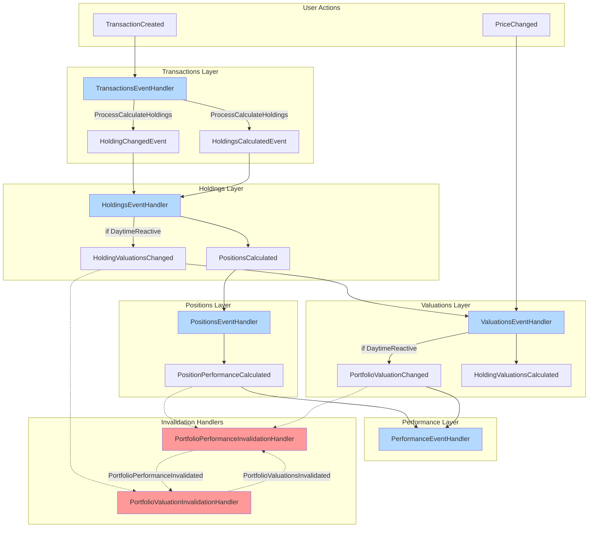
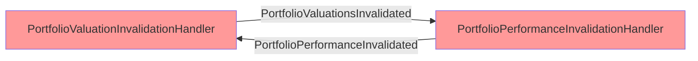
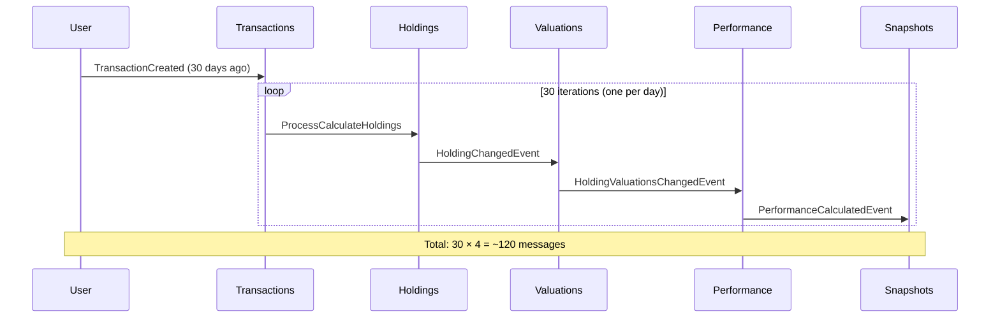
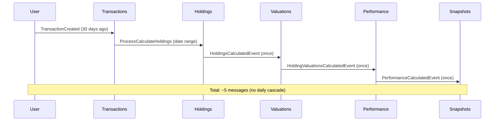

# Handler Dependency Chain

Last Updated: 2026-02-09

## Overview

This document visualizes which handlers trigger which commands/events, and identifies potential circular dependencies in the event-driven architecture.

## Full System Dependency Graph



## Handler Summary Table

| Handler | Listens To | Publishes | Dispatches | Mode Check |
|---------|------------|-----------|------------|------------|
| **TransactionsEventHandler** | `TransactionCreatedEvent` | `HoldingChangedEvent`, `HoldingsCalculatedEvent` | `ProcessCalculateHoldingsCommand` | No |
| **HoldingsEventHandler** | `HoldingChangedEvent`, `HoldingsCalculatedEvent` | `HoldingValuationsChangedEvent` | `ProcessCalculateHoldingValuationsCommand` | ✅ DaytimeReactive only |
| **ValuationsEventHandler** | `HoldingValuationsChangedEvent`, `PriceChangedEvent` | `PortfolioValuationChangedEvent`, `HoldingValuationsCalculatedEvent` | `ProcessCalculatePortfolioValuationsCommand` | ✅ DaytimeReactive only |
| **PositionsEventHandler** | `PositionsCalculatedEvent` | `PositionPerformanceCalculatedEvent` | `ProcessCalculatePositionPerformanceCommand` | ✅ DaytimeReactive only |
| **PerformanceEventHandler** | `PositionPerformanceCalculatedEvent`, `PortfolioValuationChangedEvent` | `PortfolioPerformanceCalculatedEvent` | `ProcessCalculatePortfolioPerformanceCommand` | ✅ DaytimeReactive only |
| **PortfolioValuationInvalidationHandler** | `HoldingValuationsChangedEvent` | `PortfolioValuationsInvalidated` | None | No |
| **PortfolioPerformanceInvalidationHandler** | `PositionPerformanceCalculatedEvent`, `PortfolioValuationChangedEvent` | `PortfolioPerformanceInvalidated` | None | No |

## Circular Dependency Analysis

### Portfolio Invalidation Loop (⚠️ Red Nodes)

**Risk:** `PortfolioValuationInvalidationHandler` and `PortfolioPerformanceInvalidationHandler` can potentially trigger each other in a circular pattern.



**Current Mitigation:**
1. Both handlers check `PipelineMode` before acting
2. Invalidation events don't directly trigger recalculation (just mark stale)
3. Actual recalculation is deferred to next CloseOfDay run

**File Locations:**
- `/Hoard.Bus/Portfolios/PortfolioValuationInvalidationHandler.cs`
- `/Hoard.Bus/Portfolios/PortfolioPerformanceInvalidationHandler.cs`

**Improvement Opportunity:**
- Add explicit "already invalidated" flag to prevent duplicate invalidation
- Use idempotency key based on date + portfolio ID

### No Other Circular Dependencies Detected

The main calculation chain is acyclic:
```
Transaction → Holdings → Valuations → Positions → Performance → Snapshots
```

## Critical Path for Backdated Transaction

### DaytimeReactive Mode (30-day backdate)



**Message Breakdown:**
- 30 × `ProcessCalculateHoldingsCommand`
- 30 × `HoldingChangedEvent`
- 30 × `HoldingValuationsChangedEvent`
- 30 × `PerformanceCalculatedEvent`
- **Total: ~120 messages**

**Processing Time:** 30-60 seconds
**Deadlock Risk:** HIGH

### Backfill Mode (same 30-day backdate)



**Message Breakdown:**
- 1 × `ProcessCalculateHoldingsCommand` (processes full date range)
- 1 × `HoldingsCalculatedEvent`
- 1 × `HoldingValuationsCalculatedEvent`
- 1 × `PerformanceCalculatedEvent`
- **Total: ~5 messages**

**Processing Time:** < 5 seconds
**Deadlock Risk:** LOW

## Handler File Locations

### Primary Event Handlers
| Handler | File Path | Lines |
|---------|-----------|-------|
| TransactionsEventHandler | `/Hoard.Bus/Transactions/TransactionsEventHandler.cs` | ~150 |
| HoldingsEventHandler | `/Hoard.Bus/Holdings/HoldingsEventHandler.cs` | ~200 |
| ValuationsEventHandler | `/Hoard.Bus/Valuations/ValuationsEventHandler.cs` | ~250 |
| PositionsEventHandler | `/Hoard.Bus/Positions/PositionsEventHandler.cs` | ~180 |
| PerformanceEventHandler | `/Hoard.Bus/Performance/PerformanceEventHandler.cs` | ~220 |

### Saga Orchestrators
| Saga | File Path | Purpose |
|------|-----------|---------|
| CloseOfDaySaga | `/Hoard.Bus/Chrono/CloseOfDaySaga.cs` | Master orchestration for nightly batch |
| RefreshPricesSaga | `/Hoard.Bus/Chrono/RefreshPricesSaga.cs` | Coordinate price fetching |
| CalculateValuationsSaga | `/Hoard.Bus/Valuations/CalculateValuationsSaga.cs` | Two-phase valuation orchestration |
| CalculatePerformanceSaga | `/Hoard.Bus/Performance/CalculatePerformanceSaga.cs` | Two-phase performance orchestration |

### Invalidation Handlers
| Handler | File Path | Purpose |
|---------|-----------|---------|
| PortfolioValuationInvalidationHandler | `/Hoard.Bus/Portfolios/PortfolioValuationInvalidationHandler.cs` | Mark portfolio valuations stale |
| PortfolioPerformanceInvalidationHandler | `/Hoard.Bus/Portfolios/PortfolioPerformanceInvalidationHandler.cs` | Mark portfolio performance stale |

## PipelineMode Guard Clauses

Many handlers have conditional logic based on `PipelineMode`:

```csharp
// Example from HoldingsEventHandler.cs
if (message.PipelineMode == PipelineMode.DaytimeReactive)
{
    // Publish HoldingValuationsChangedEvent (cascade)
    await _bus.Publish(new HoldingValuationsChangedEvent(...));
}
else
{
    // Backfill or CloseOfDay: skip cascade
}
```

**Search pattern:**
```bash
grep -r "PipelineMode.DaytimeReactive" Hoard.Bus/
```

**Files with mode checks:**
- `HoldingsEventHandler.cs` (3 locations)
- `ValuationsEventHandler.cs` (2 locations)
- `PositionsEventHandler.cs` (1 location)
- `PerformanceEventHandler.cs` (1 location)

## Cascade Depth Visualization

```
Transaction (depth 0)
  └─ Holdings (depth 1)
      ├─ Valuations (depth 2)
      │   └─ Performance (depth 3)
      │       └─ Snapshots (depth 4)
      └─ Positions (depth 2)
          └─ Performance (depth 3)
              └─ Snapshots (depth 4)
```

**Maximum cascade depth: 5 levels**

**Amplification factor (DaytimeReactive):**
- 1 transaction × 30 days = 30 messages at depth 1
- 30 messages × 5 levels = **150 total messages**

## Deadlock Scenarios

### Scenario 1: Overlapping Date Ranges

```
Thread A: Transaction dated 2024-01-15 → processes 2024-01-15 to 2024-02-09
Thread B: Transaction dated 2024-01-20 → processes 2024-01-20 to 2024-02-09

Overlap: 2024-01-20 to 2024-02-09 (20 days)
```

**Deadlock mechanism:**
1. Thread A locks Portfolio row for 2024-01-20
2. Thread B waits for same lock
3. Thread A needs to update Position row (held by Thread B)
4. **Deadlock**

### Scenario 2: SQL Lock Escalation

```
Single transaction updates 30+ days
  → 30 × Holdings row updates
  → 30 × Valuations row updates
  → 30 × Performance row updates
  → 90+ row locks → TABLE LOCK (escalation)
  → All other operations blocked
```

**SQL Server lock escalation threshold:** 5,000 row locks → table lock

**Mitigation:**
```sql
SET LOCK_ESCALATION = DISABLE; -- For specific tables
```

### Scenario 3: Rebus Message Deadlock

```
Message A: ProcessCalculateHoldings (Portfolio 1, 2024-01-15)
Message B: ProcessCalculateHoldings (Portfolio 1, 2024-01-20)

Both messages processed in parallel (different Rebus workers)
  → Both attempt UPDATE on same Portfolio row
  → SQL deadlock
  → Rebus retry
  → **Infinite retry loop**
```

**Mitigation:**
- Increase Rebus `MaxParallelism` to 1 (sequential processing)
- OR: Implement pessimistic locking at application layer

## Recommended Architectural Changes

### Short-term: Add Circuit Breaker

```csharp
if (CalculateDepth > 5)
{
    throw new InvalidOperationException("Cascade depth exceeded");
}
```

### Medium-term: Date-Range Locking

```csharp
var lockKey = $"portfolio:{portfolioId}:date-range:{fromDate}-{toDate}";
if (!await _distributedLock.TryAcquireAsync(lockKey))
{
    throw new ConcurrentRecalculationException();
}
```

### Long-term: CQRS Read Models

Separate write models (domain events) from read models (denormalized snapshots):
- Writes: Event-sourced transaction log
- Reads: Pre-aggregated daily snapshots
- No deep cascading for reads

## Related Documentation

- [PipelineMode Behavior Matrix](pipeline-mode.md) - Understand mode-based cascading
- [Transaction Created Event Flow](event-flows/transaction-created-daytime.md) - Detailed cascade example
- [Close of Day Saga](sagas/close-of-day-saga.md) - Controlled batch processing alternative
- ADR-003: Date-Range Cascade Limits (to be created)
