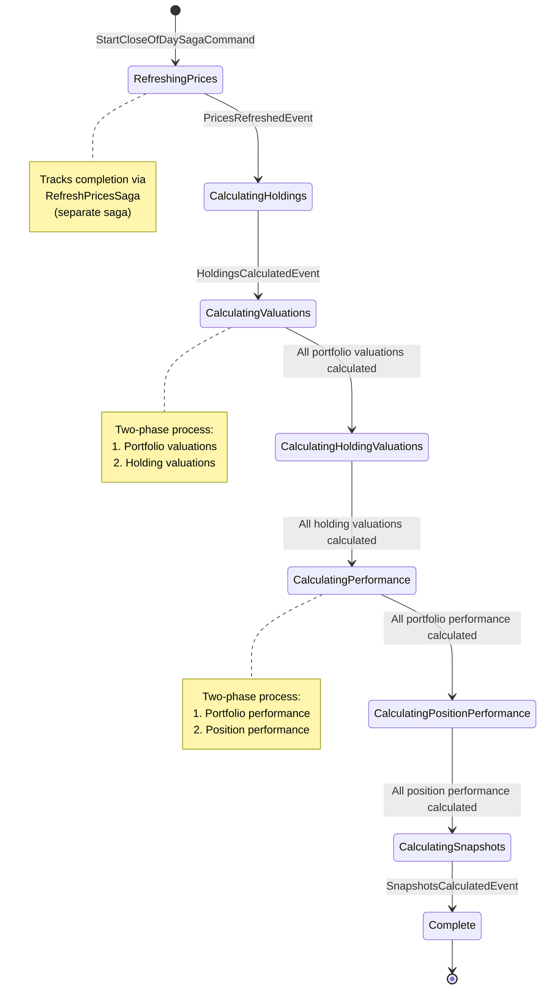

# Close of Day Saga

Last Updated: 2026-02-09

## Purpose

Orchestrates the nightly batch processing to rebuild all metrics for the previous business day. Uses `CloseOfBusiness` PipelineMode to avoid cascading events and ensure controlled, sequential execution.

## State Machine



## Saga State Data

The saga maintains these correlation IDs and flags:

| Field | Type | Purpose |
|-------|------|---------|
| `Date` | `DateOnly` | The close-of-business date being processed |
| `PricesRunId` | `Guid` | Correlation ID for RefreshPricesSaga |
| `HoldingsRunId` | `Guid` | Correlation ID for holdings calculations |
| `ValuationsRunId` | `Guid` | Correlation ID for valuations saga |
| `PerformanceRunId` | `Guid` | Correlation ID for performance saga |
| `SnapshotsRunId` | `Guid` | Correlation ID for snapshot calculations |
| `PricesRefreshed` | `bool` | Flag - prices complete |
| `HoldingsCalculated` | `bool` | Flag - holdings complete |
| `ValuationsCalculated` | `bool` | Flag - valuations complete |
| `PerformanceCalculated` | `bool` | Flag - performance complete |
| `SnapshotsCalculated` | `bool` | Flag - snapshots complete |

## Execution Flow

### 1. Initialization
**Trigger:** Scheduled job dispatches `StartCloseOfDaySagaCommand` (via Hangfire)

```csharp
Bus.Send(new StartCloseOfDaySagaCommand(previousBusinessDate));
```

**Action:**
- Create saga instance with `Date = previousBusinessDate`
- Generate `PricesRunId`
- Dispatch `StartRefreshPricesSagaCommand`
- Set state to `RefreshingPrices`

### 2. Price Refresh
**Wait for:** `PricesRefreshedEvent` from RefreshPricesSaga

**Guard:**
```csharp
if (message.RunId != Data.PricesRunId) return; // Ignore unrelated events
```

**Action:**
- Set `PricesRefreshed = true`
- Generate `HoldingsRunId`
- Dispatch `ProcessCalculateHoldingsForAllPortfoliosCommand`
- Set state to `CalculatingHoldings`

### 3. Holdings Calculation
**Wait for:** `HoldingsCalculatedEvent`

**Guard:**
```csharp
if (message.RunId != Data.HoldingsRunId) return;
if (!Data.PricesRefreshed) return; // Must have prices first
```

**Action:**
- Set `HoldingsCalculated = true`
- Generate `ValuationsRunId`
- Dispatch `StartCalculateValuationsSagaCommand`
- Set state to `CalculatingValuations`

### 4. Valuations Calculation
**Wait for:** `ValuationsCalculatedEvent` from CalculateValuationsSaga

**Guard:**
```csharp
if (message.RunId != Data.ValuationsRunId) return;
if (!Data.HoldingsCalculated) return; // Must have holdings first
```

**Action:**
- Set `ValuationsCalculated = true`
- Generate `PerformanceRunId`
- Dispatch `StartCalculatePerformanceSagaCommand`
- Set state to `CalculatingPerformance`

### 5. Performance Calculation
**Wait for:** `PerformanceCalculatedEvent` from CalculatePerformanceSaga

**Guard:**
```csharp
if (message.RunId != Data.PerformanceRunId) return;
if (!Data.ValuationsCalculated) return; // Must have valuations first
```

**Action:**
- Set `PerformanceCalculated = true`
- Generate `SnapshotsRunId`
- Dispatch `ProcessCalculateSnapshotsForAllPortfoliosCommand`
- Set state to `CalculatingSnapshots`

### 6. Snapshots
**Wait for:** `SnapshotsCalculatedEvent`

**Guard:**
```csharp
if (message.RunId != Data.SnapshotsRunId) return;
if (!Data.PerformanceCalculated) return; // Must have performance first
```

**Action:**
- Set `SnapshotsCalculated = true`
- Mark saga as complete
- Saga instance is persisted and archived

## Nested Sagas

The CloseOfDaySaga orchestrates three sub-sagas:

### RefreshPricesSaga
- Fetches latest prices for all instruments
- Updates `Price` table
- Publishes `PricesRefreshedEvent` when complete

### CalculateValuationsSaga
- Two-phase calculation:
  1. Portfolio valuations (sum of holdings)
  2. Holding valuations (quantity × price)
- Publishes `ValuationsCalculatedEvent` when both phases complete

### CalculatePerformanceSaga
- Two-phase calculation:
  1. Portfolio performance (aggregated returns)
  2. Position performance (individual position returns)
- Publishes `PerformanceCalculatedEvent` when both phases complete

## Guard Clauses and Sequencing

Each transition has guard clauses to prevent premature progression:

```csharp
// Example: Don't start valuations until both prices AND holdings are done
if (!Data.PricesRefreshed || !Data.HoldingsCalculated)
{
    return; // Not ready yet
}
```

This ensures:
- Sequential execution (no parallel stages)
- Data consistency (each stage builds on previous)
- Idempotency (duplicate events are ignored)

## PipelineMode Behavior

The saga uses `PipelineMode.CloseOfDay` for all calculations:

```csharp
Bus.Send(new ProcessCalculateHoldingsCommand(
    portfolioId,
    date,
    PipelineMode.CloseOfDay // ← No cascading events
));
```

**Effect:**
- `HoldingChangedEvent` is **not** published (no cascade)
- Only `HoldingsCalculatedEvent` is published (saga listens to this)
- Explicit orchestration instead of reactive cascading
- Prevents deadlocks and ensures predictable execution

See: [PipelineMode Behavior Matrix](../pipeline-mode.md)

## Execution Time

Typical nightly run:
- **Prices:** 10-30 seconds (depends on instrument count)
- **Holdings:** 5-15 seconds
- **Valuations:** 10-30 seconds (two-phase)
- **Performance:** 15-45 seconds (two-phase, computation-heavy)
- **Snapshots:** 5-10 seconds

**Total: 45-120 seconds** (1-2 minutes)

## Error Handling

### Current Limitations

❌ **No timeout handling**
- If an event is lost, saga remains stuck forever
- No automatic timeout or compensation

❌ **No compensation logic**
- If a stage fails (e.g., database error), no rollback
- Partial state may remain inconsistent

❌ **No explicit monitoring**
- No alerts if saga doesn't complete within expected time
- Must manually check Rebus saga storage

### Recommended Improvements

1. **Add saga timeout:**
   ```csharp
   [SagaTimeout(minutes: 10)]
   public async Task Handle(SagaTimeoutEvent message)
   {
       // Log failure, send alert, mark saga as failed
   }
   ```

2. **Add compensation handlers:**
   ```csharp
   public async Task Handle(HoldingsCalculationFailedEvent message)
   {
       // Rollback partial calculations
       // Send alert to operations
       // Mark saga as failed
   }
   ```

3. **Add stage monitoring:**
   ```csharp
   TelemetryClient.TrackEvent("CloseOfDaySaga.StageCompleted", new
   {
       Stage = "Holdings",
       Duration = elapsed,
       Date = Data.Date
   });
   ```

## Correlation Strategy

### RunId Pattern
Each stage has a unique `RunId` (GUID):
- Prevents cross-contamination between different saga runs
- Enables parallel execution for different dates (future enhancement)
- Simplifies debugging (filter logs by RunId)

### Date as Correlation Key
The saga is keyed by `Date`:
```csharp
[CorrelateOn(nameof(Date))]
```

**Implication:** Only one CloseOfDaySaga can run per date at a time.

**Trade-off:**
- ✅ Prevents duplicate processing for same date
- ❌ Cannot reprocess a date while another run is in progress

## Code Locations

**Primary saga file:**
- `/Hoard.Bus/Chrono/CloseOfDaySaga.cs` (lines 1-250+)

**Nested sagas:**
- `/Hoard.Bus/Chrono/RefreshPricesSaga.cs`
- `/Hoard.Bus/Valuations/CalculateValuationsSaga.cs`
- `/Hoard.Bus/Performance/CalculatePerformanceSaga.cs`

**Trigger (Hangfire job):**
- `/Hoard.Scheduler/Jobs/CloseOfDayJob.cs`

**Rebus configuration:**
- `/Hoard.Core/Infrastructure/ServiceCollectionExtensions.cs` (saga storage setup)

## Debugging Tips

### Check saga state:
```sql
-- Query Rebus saga storage
SELECT TOP 10 *
FROM [RebusMessages].[Sagas]
WHERE [SagaType] = 'CloseOfDaySaga'
ORDER BY [Id] DESC;
```

### Trace RunId through logs:
```kusto
// Application Insights query
traces
| where customDimensions.RunId == "abc-123-def"
| order by timestamp asc
| project timestamp, message, customDimensions
```

### Common stuck states:
1. **Stuck in RefreshingPrices:** RefreshPricesSaga failed or event lost
2. **Stuck in CalculatingValuations:** CalculateValuationsSaga timeout
3. **Stuck in CalculatingPerformance:** Long-running computation (check for large portfolios)

## Related Documentation

- [PipelineMode Behavior Matrix](../pipeline-mode.md) - Why CloseOfDay mode is used
- [Transaction Created Event Flow](../event-flows/transaction-created-daytime.md) - Contrast with DaytimeReactive
- [Handler Dependencies](../handler-dependencies.md) - Full system cascade map
- ADR-002: Saga Correlation Keys (to be created)
